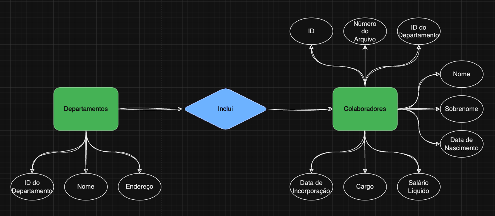

# Bancos de dados relacionais

## Aula 01 - Manhã

### Exercício 1

#### Questão A

Diagrama:

#### Questão B

Código utilizado no arquivo db.sql

<a href="db.sql">

### Exercício 2

#### Questão A

Para a tabela de colaboradores, escolhi como cháve primária o campo "ID", utilizado como Colaborator_ID.

Motivo: Identificador único para cada colaborador

#### Questão B

Para a tabela de Departamentos, escolhi como cháve primária o campo "ID", utilizado como Department_ID.

Motivo: Identificador único para cada departamento

#### Questão C

Existe a relação:

- Departamento possui colaboradores
- Cada colaborador pertence à um departamento

Portanto, por hierarquia, departamentos engloba colaboradores, então eu criei o campo de Foreign Key na tabela de colaboradores:

fk_Department_ID

### Exercício 3

Novamente, arquivo db.sql possui os comandos utilizados